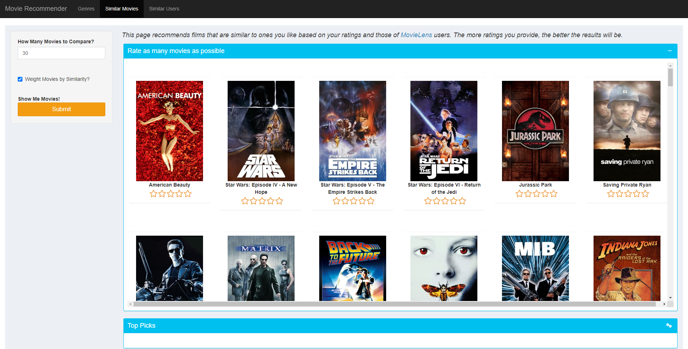

# Movie Recommender

This is a simple movie recommendation application built using the R Shiny engine and film ratings from the [MovieLens 1M Dataset](https://grouplens.org/datasets/movielens/) provided by [GroupLens Research](https://grouplens.org/) (paper available [here](http://dx.doi.org/10.1145/2827872)). It implements popularity ranking, user-based collaborative filtering (UBCF), and item-based collaborative filtering (IBCF), with algorithm implementations inspired by the [recommenderlab](https://github.com/mhahsler/recommenderlab) library (paper available [here](https://arxiv.org/abs/2205.12371)). The design was heavily inspired by this [BookRecommender](https://github.com/pspachtholz/BookRecommender). The application is primarily for demonstration and algorithm comparison purposes (the ratings dataset used is fairly limited in size and scope). The MovieLens 1M Dataset collected 1 million anonymous ratings of 3,900 movies from approximately 6,000 [MovieLens](https://movielens.org/) users who joined the site in 2000. The application can be run locally using RStudio, at the command line via `R -e "shiny::runApp('/path/to/Movie-Recommender')"`, or viewed at https://pilhardt.shinyapps.io/movie_recommender/.  
 
